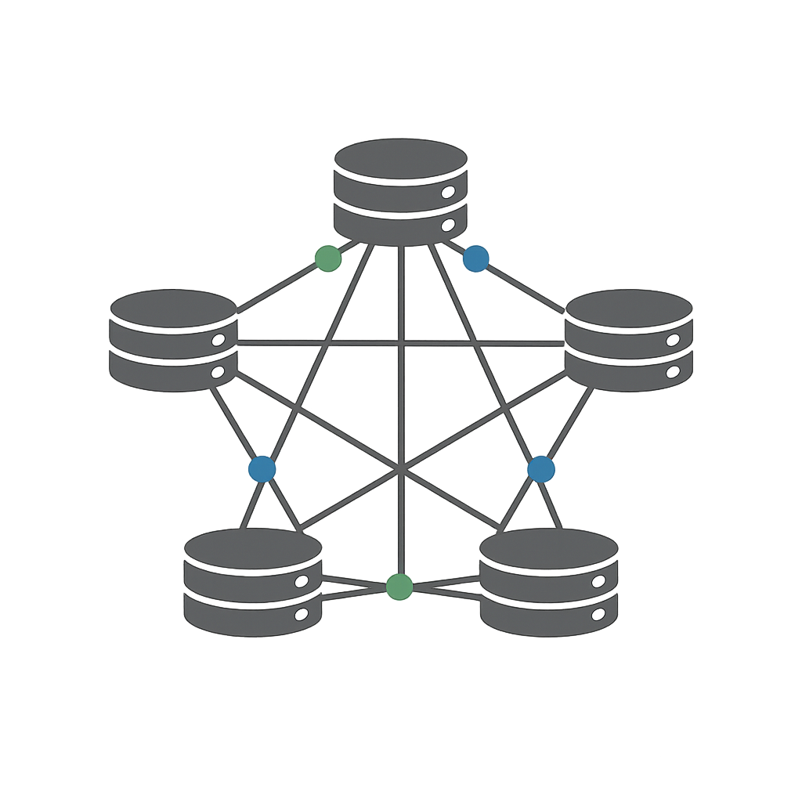

# GraphQLite

<p align="center">
    
</p>

An SQLite extension that adds graph database capabilities using the Cypher query language.

GraphQLite lets you store and query graph data directly in SQLite—combining the simplicity of a single-file, zero-config embedded database with Cypher's expressive power for modeling relationships. Perfect for applications that need graph queries without a separate database server, or for local development and learning without standing up additional infrastructure.

## Installation

**Python** (recommended):
```bash
pip install graphqlite
```

**Rust**:
```bash
cargo add graphqlite
```

**From source** (requires gcc, bison, flex):
```bash
make extension
# Creates build/graphqlite.dylib (macOS), .so (Linux), or .dll (Windows)
```

## Quick Start

### Python

```python
from graphqlite import Graph

# High-level Graph API
g = Graph(":memory:")
g.upsert_node("alice", {"name": "Alice", "age": 30}, label="Person")
g.upsert_node("bob", {"name": "Bob", "age": 25}, label="Person")
g.upsert_edge("alice", "bob", {"since": 2020}, rel_type="KNOWS")

print(g.stats())  # {'nodes': 2, 'edges': 1}
print(g.get_neighbors("alice"))  # [{'id': 'bob', ...}]

# Or use raw Cypher
results = g.query("MATCH (a:Person)-[:KNOWS]->(b) RETURN a.name, b.name")
```

See the [Python bindings documentation](bindings/python/README.md) for the full API.

### SQL

```sql
.load build/graphqlite.dylib

-- Create nodes and relationships
SELECT cypher('CREATE (a:Person {name: "Alice", age: 30})');
SELECT cypher('CREATE (b:Person {name: "Bob", age: 25})');
SELECT cypher('
    MATCH (a:Person {name: "Alice"}), (b:Person {name: "Bob"})
    CREATE (a)-[:KNOWS]->(b)
');

-- Query the graph
SELECT cypher('MATCH (a:Person)-[:KNOWS]->(b) RETURN a.name, b.name');
```

## Cypher Support

GraphQLite supports a substantial subset of Cypher:

**Clauses**: MATCH, OPTIONAL MATCH, CREATE, MERGE, SET, DELETE, DETACH DELETE, REMOVE, WITH, UNWIND, FOREACH, RETURN (with DISTINCT, ORDER BY, SKIP, LIMIT).

**Patterns**: Nodes `(n:Label {prop: value})`, relationships `-[:TYPE]->`, variable-length paths `[*1..3]`, bidirectional matching.

**Functions**:
- **String**: `toLower`, `toUpper`, `trim`, `ltrim`, `rtrim`, `replace`, `substring`, `left`, `right`, `split`, `reverse`, `toString`
- **Math**: `abs`, `ceil`, `floor`, `round`, `sign`, `sqrt`, `log`, `log10`, `exp`, `sin`, `cos`, `tan`, `asin`, `acos`, `atan`, `rand`, `pi`, `e`
- **List**: `head`, `tail`, `last`, `size`, `range`, `reverse`, `keys`
- **Aggregate**: `count`, `sum`, `avg`, `min`, `max`, `collect`
- **Entity**: `id`, `labels`, `type`, `properties`, `startNode`, `endNode`
- **Path**: `nodes`, `relationships`, `length`
- **Type**: `toInteger`, `toFloat`, `toBoolean`, `coalesce`
- **Temporal**: `date`, `datetime`, `time`, `timestamp`, `localdatetime`

**Predicates**: `EXISTS { pattern }`, `EXISTS(n.property)`, `all(x IN list WHERE ...)`, `any(...)`, `none(...)`, `single(...)`, `reduce(acc = init, x IN list | expr)`

**Operators**: `+`, `-`, `*`, `/`, `%`, `=`, `<>`, `<`, `>`, `<=`, `>=`, `AND`, `OR`, `NOT`, `XOR`, `IN`, `STARTS WITH`, `ENDS WITH`, `CONTAINS`, `IS NULL`, `IS NOT NULL`

## Graph Algorithms

Built-in algorithms return JSON results:

```sql
-- PageRank
SELECT cypher('RETURN pageRank(0.85, 20)');           -- All nodes with scores
SELECT cypher('RETURN topPageRank(10)');              -- Top 10 nodes
SELECT cypher('RETURN personalizedPageRank([1,2])'); -- Seeded PageRank

-- Community Detection (Label Propagation)
SELECT cypher('RETURN labelPropagation(10)');         -- All community assignments
SELECT cypher('RETURN communityOf(n)');               -- Single node's community
SELECT cypher('RETURN communityMembers(1)');          -- Nodes in community 1
SELECT cypher('RETURN communityCount()');             -- Number of communities

-- Use results in SQL
SELECT json_extract(value, '$.node_id') as id,
       json_extract(value, '$.score') as score
FROM json_each(cypher('RETURN pageRank()'));
```

## Parameterized Queries

Use parameters to prevent SQL injection:

```sql
-- Named parameters with $prefix
SELECT cypher('MATCH (n:Person {name: $name}) RETURN n', '{"name": "Alice"}');

-- Works with all operations
SELECT cypher('CREATE (n:Person {name: $name, age: $age})', '{"name": "Bob", "age": 30}');
```

## Storage Model

GraphQLite uses a typed property graph model stored in regular SQLite tables. Nodes and edges are stored with typed property tables (text, integer, real, boolean), making it possible to query the underlying data with plain SQL when needed. The schema is created automatically when the extension loads.

## Language Bindings

### Python

```bash
pip install graphqlite
```

**High-level Graph API** (recommended for most use cases):
```python
from graphqlite import Graph

g = Graph("my_graph.db")
g.upsert_node("n1", {"name": "Alice"}, label="Person")
g.upsert_edge("n1", "n2", {}, rel_type="KNOWS")
print(g.pagerank())  # Built-in graph algorithms
```

**Low-level Cypher API** (for complex queries):
```python
from graphqlite import connect

conn = connect(":memory:")
conn.cypher("CREATE (n:Person {name: 'Alice'})")
for row in conn.cypher("MATCH (n:Person) RETURN n.name"):
    print(row["n.name"])
```

See [bindings/python/README.md](bindings/python/README.md) for full documentation.

### Rust

```toml
[dependencies]
graphqlite = "0.1"
```

```rust
use graphqlite::Connection;

let conn = Connection::open_in_memory()?;
conn.cypher("CREATE (n:Person {name: 'Alice'})")?;
for row in conn.cypher("MATCH (n:Person) RETURN n.name")? {
    println!("{}", row.get::<String>(0)?);
}
```

## Examples

The `examples/` directory contains tutorials:

```bash
# SQL tutorials
sqlite3 < examples/sql/01_getting_started.sql

# Python examples
python examples/python/knowledge_graph.py

# Rust examples
cd bindings/rust && cargo run --example basic
```

## Testing

```bash
make test              # Run test suite
make test-functional   # SQL integration tests
make performance       # Performance benchmarks
```

## Performance

Benchmarks on Apple M1 Max, testing insertion, traversal, and algorithm performance across graph topologies (uniform, normal distribution, power-law/scale-free):

**Insertion** (nodes + edges)
| Nodes | Edges | Time   | Rate   |
|-------|-------|--------|--------|
| 100K  | 500K  | 445ms  | 1.3M/s |
| 500K  | 2.5M  | 2.30s  | 1.3M/s |
| 1M    | 5.0M  | 5.16s  | 1.1M/s |

**Traversal by topology** (1-hop and 2-hop query time)
| Topology | Nodes | Edges | 1-hop | 2-hop |
|----------|-------|-------|-------|-------|
| chain    | 100K  | 99K   | <1ms  | <1ms  |
| sparse   | 100K  | 500K  | <1ms  | <1ms  |
| moderate | 100K  | 2.0M  | <1ms  | 2ms   |
| dense    | 100K  | 5.0M  | <1ms  | 9ms   |
| normal   | 100K  | 957K  | <1ms  | 1ms   |
| powerlaw | 100K  | 242K  | <1ms  | <1ms  |
| moderate | 500K  | 10.0M | 1ms   | 2ms   |
| moderate | 1M    | 20.0M | <1ms  | 2ms   |

**Graph algorithms**
| Algorithm | Nodes | Edges | Time   |
|-----------|-------|-------|--------|
| PageRank  | 100K  | 500K  | 148ms  |
| LabelProp | 100K  | 500K  | 154ms  |
| PageRank  | 500K  | 2.5M  | 953ms  |
| LabelProp | 500K  | 2.5M  | 811ms  |
| PageRank  | 1M    | 5.0M  | 37.81s |
| LabelProp | 1M    | 5.0M  | 40.21s |

**Cypher queries**
| Query     | G(N:100K, E:500K) | G(N:500K, E:2.5M) | G(N:1M, E:5M) |
|-----------|-------------------|-------------------|---------------|
| Lookup    | <1ms              | 1ms               | <1ms          |
| 1-hop     | <1ms              | <1ms              | <1ms          |
| 2-hop     | <1ms              | <1ms              | <1ms          |
| 3-hop     | 1ms               | 1ms               | 1ms           |
| Filter    | 341ms             | 1.98s             | 3.79s         |
| MATCH all | 360ms             | 2.05s             | 3.98s         |

Run `make performance` to benchmark on your hardware.

---

[MIT License](LICENSE)
