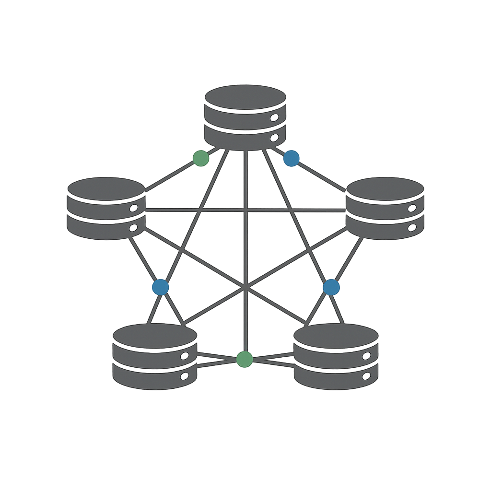

# GraphQLite

<p align="center">
    
</p>

An SQLite extension that adds graph database capabilities using the Cypher query language.

Store and query graph data directly in SQLite—combining the simplicity of a single-file, zero-config embedded database with Cypher's expressive power for modeling relationships.

## Installation

```bash
brew install graphqlite       # macOS/Linux (Homebrew)
pip install graphqlite        # Python
cargo add graphqlite          # Rust
npm install graphqlite        # TypeScript / Node.js
```

## Quick Start

```python
from graphqlite import Graph

g = Graph(":memory:")
g.upsert_node("alice", {"name": "Alice", "age": 30}, label="Person")
g.upsert_node("bob", {"name": "Bob", "age": 25}, label="Person")
g.upsert_edge("alice", "bob", {"since": 2020}, rel_type="KNOWS")

# Query with Cypher
results = g.query("MATCH (a:Person)-[:KNOWS]->(b) RETURN a.name, b.name")

# Built-in graph algorithms
g.pagerank()
g.louvain()
g.dijkstra("alice", "bob")
```

## Features

- **Cypher queries** — MATCH, CREATE, MERGE, SET, DELETE, WITH, UNWIND, RETURN
- **Graph algorithms** — PageRank, Louvain, Dijkstra, BFS/DFS, connected components, and more
- **Zero configuration** — Works with any SQLite database, no server required
- **Multiple bindings** — Python, Rust, TypeScript, and raw SQL interfaces

## openCypher Conformance

GraphQLite is validated against the official [openCypher Technology Compatibility
Kit (TCK)](https://github.com/opencypher/openCypher) — the canonical conformance
suite for the Cypher query language. Current coverage:

| Area | Scenarios | Passing |
|------|-----------|---------|
| **Overall** | **3,876** | **97.7%** |
| Expressions (temporal, lists, maps, comparison, literals, …) | 2,599 | 98.0% |
| Clauses (MATCH, WITH, MERGE, CREATE, SET, DELETE, UNWIND, …) | 1,247 | 97.2% |
| Use cases (triadic selection, subgraph counting) | 30 | 100% |

Run it yourself with `angreal test tck`. The remaining gaps are tracked in
[`docs/testing/semantic-coverage-matrix.md`](docs/testing/semantic-coverage-matrix.md)
and concentrate in a few deep areas (DST-aware timezone arithmetic, nested
existential subqueries, multi-row MERGE). Booleans, strings, null handling,
CREATE/SET/DELETE/REMOVE, UNION, and SKIP/LIMIT are at 100%.

## Documentation

**[Full Documentation](https://colliery-io.github.io/graphqlite/)** — Tutorials, how-to guides, and API reference

## Examples

```bash
# SQL tutorials
sqlite3 < examples/sql/01_getting_started.sql

# GraphRAG with HotpotQA dataset
cd examples/llm-graphrag
uv sync && uv run python ingest.py
uv run python rag.py "Were Scott Derrickson and Ed Wood of the same nationality?"
```

## License

[MIT](LICENSE)
